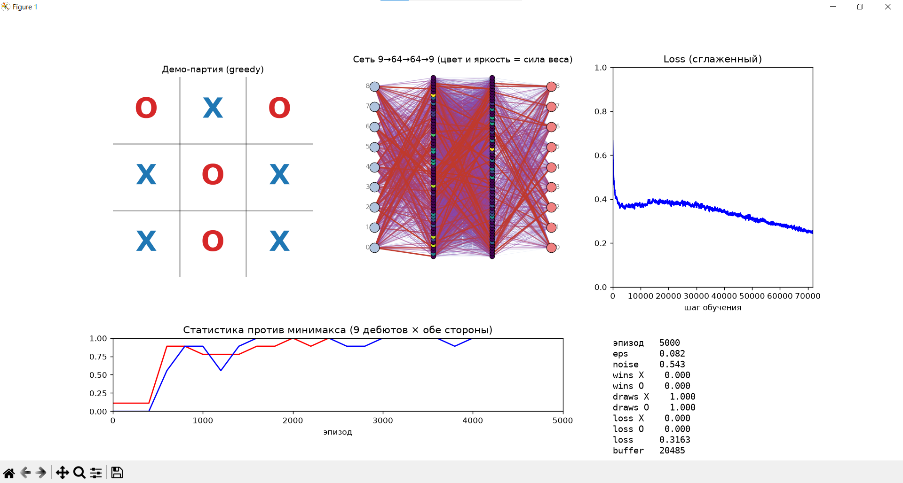

# Tic-Tac-Toe RL

Обучение агента игре в крестики-нолики методом **Monte Carlo Q-Learning** с self-play, аугментацией симметриями доски и визуализацией весов сети в реальном времени.


---

## Результат

Сеть обучена **с нуля за ~5000 эпизодов** и достигает **100% ничьих против идеального минимакса** - это математический оптимум крестиков-ноликов. При идеальной игре обеих сторон ничья неизбежна.

```text
agent as X vs minimax: wins=0.000 draws=1.000 losses=0.000
agent as O vs minimax: wins=0.000 draws=1.000 losses=0.000
```



---

## Как это работает

Сеть получает на вход доску 3×3 как 9 чисел и выдаёт оценку для каждого из 9 возможных ходов. Обучается игрой **сама с собой**: в конце партии каждый ход получает награду `+1` / `0` / `-1`, и сеть учится предсказывать эту награду заранее. Никаких подсказок снаружи - только итог партии.

---

## Быстрый старт

```bash
pip install -r requirements.txt
python main.py
```

Окно визуализации откроется автоматически. По завершении обученная сеть сохранится в `qnet.pt`.

---

## Стек

- **Python** 3.12.0
- **PyTorch** 2.14.0
- **NumPy** 2.5.3
- **Matplotlib** 3.11.2

---

## Архитектура

Проект разбит на независимые модули с односторонними зависимостями:

- `game/` - правила доски и партии (`Board`, `Game`), идеальный игрок (`minimax`)
- `model/` - MLP-аппроксиматор Q-значений (`9 → 64 → 64 → 9`)
- `agent/` - ε-greedy выбор хода с маскированием нелегальных клеток
- `training/` - ReplayBuffer и цикл self-play обучения (MC + аугментация ×8)
- `viz/` - живая визуализация через Matplotlib
- `tests/` - юнит-тесты инвариантов (перспектива, симметрии, аугментация)

### Ключевые решения

- **Перспектива того, чей ход.** Доска хранит свои фишки как `+1`, чужие как `-1`. После хода знак инвертируется. Одна сеть играет за обе стороны.
- **Маскирование нелегальных ходов в `Agent`, не в сети.** Сеть возвращает Q для всех 9 клеток; `Agent.mask_illegal` ставит `-inf` на занятых.
- **Аугментация симметриями ×8.** Каждый батч размножается всеми поворотами и отражениями доски - эффективный размер данных ×8.
- **Monte Carlo target.** В конце партии каждому ходу проставляется итог `±1/0` с точки зрения того, кто ходил.
- **Все гиперпараметры в `config.py`.** Ни одно число не захардкожено в модулях.
- **Фиксация seed** (`random`, `numpy`, `torch`) для воспроизводимости.

### Что решалось по ходу

- **Гашение exploration** - без него остаточный ε отравляет MC-метки после сходимости.
- **Рандомные дебюты** - иначе self-play застревает в одной детерминированной линии и не покрывает дерево игры.
- **Подмешивание минимакса в буфер** - даёт сети образец оптимальной игры в позициях, куда сама бы она не зашла.
- **Аудит против минимакса, а не self-play winrate** - self-play метрика шумная, честная оценка силы только против внешнего игрока.
- **Сохранение только лучшей сети** - `qnet.pt` перезаписывается, только если текущий аудит лучше рекорда.

---

## Структура проекта

```text
config.py              # все гиперпараметры
main.py                # скрипт обучения
play_vs_player.py      # игра человека против сети (GUI)
play_vs_minimax.py     # оценка против идеального игрока
pyproject.toml         # конфиг ruff
Makefile               # команды для разработки
requirements.txt       # зависимости
benchmark.csv          # логи прогонов
qnet.pt                # сохранённые веса сети
game/
    board.py           # доска 3×3, симметрии, ходы
    game.py            # управление партией
    minimax.py         # negamax с мемоизацией
model/
    qnet.py            # MLP-аппроксиматор Q(s, a)
agent/
    agent.py           # ε-greedy выбор хода
training/
    buffer.py          # кольцевой ReplayBuffer
    trainer.py         # цикл self-play обучения
viz/
    visualizer.py      # визуализация обучения
tests/
    test_board.py      # инварианты доски и симметрий
    test_game.py       # перспектива первого игрока
    test_training.py   # аугментация и выбор хода
```

---

## Обучение и запуск

```bash
python main.py             # обучение с визуализацией
python play_vs_player.py   # играть против сети (клик по доске)
python play_vs_minimax.py  # проверить силу против минимакса
```

Через Makefile:

```bash
make install   # pip install -r requirements.txt
make train     # python main.py
make play      # python play_vs_player.py
make minimax   # python play_vs_minimax.py
```

---

## Тесты и линтер

```bash
make lint      # ruff check
make test      # pytest
make check     # линтер + тесты
make format    # ruff format
make fix       # авто-исправление + форматирование
```

Настройки ruff - в `pyproject.toml`.

---

## Бенчмарк сходимости

В self-play обычные метрики (winrate/draws) **несравнимы между прогонами** - обе стороны это одна и та же сеть, а MC-метки зашумлены exploration. Поэтому эталонная метрика одна: **draws против минимакса**.

Каждый запуск `main.py` дописывает строку в `benchmark.csv`:

- `run_name`, все гиперпараметры (`lr`, `batch_size`, `eps_decay`, `buffer`)
- эпизод сходимости (`draws=1.000` при аудите vs minimax)
- итоги финального аудита (`final_draws`, `final_noise`)
- финальные точки greedy-кривой (`eval_draws`, `eval_draws_best`)
- сглаженный loss, время обучения

Сравнение версий - просто просмотр таблицы.

> **Осторожно:** не открывайте `benchmark.csv` и не сохраняйте его из Excel. В русской локали Excel парсит числа с точкой (`9.8`) как даты и портит данные. Для анализа используйте Data → From Text/CSV (разделитель `;`, кодировка UTF-8).

---

## Пример вывода

```text
[5000] noise: 0.142
[5000] X vs minimax: wins=0.000 draws=1.000 losses=0.000
[5000] O vs minimax: wins=0.000 draws=1.000 losses=0.000
[5000] record (draws=1.000) - saved qnet.pt
=== ИТОГ: v3: eps_end=0, decay=5k, buffer=50k, steps=8 ===
сходимость (draws=1.000 vs minimax): ep 5000
```

---

## Планы по улучшению

- **TD(λ)-bootstrapping** вместо чистого Monte Carlo - точнее сигнал на каждый ход, быстрее сходимость.
- **Экспорт весов в ONNX** для инференса без PyTorch.
- **Сравнение с DQN и AlphaZero-подходом** на большем поле (Connect Four, Othello).

---

## Лицензия

Учебный проект. Свободно используйте для своего обучения. MIT.